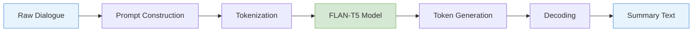
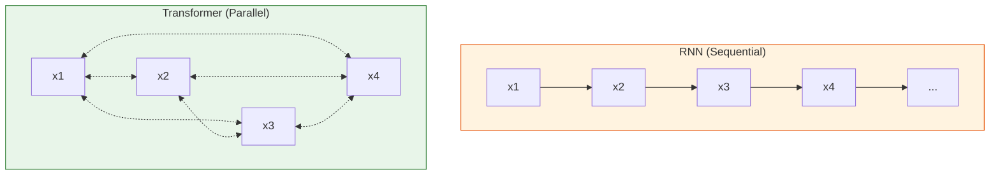
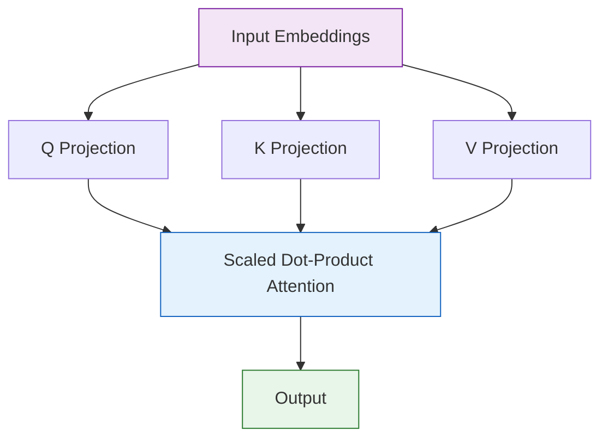
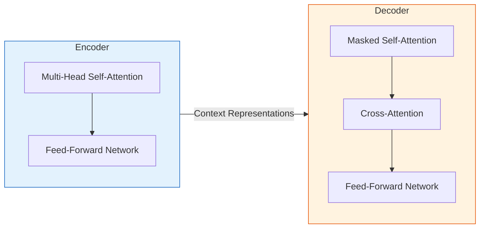
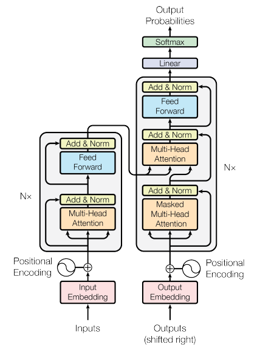
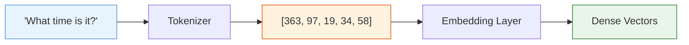
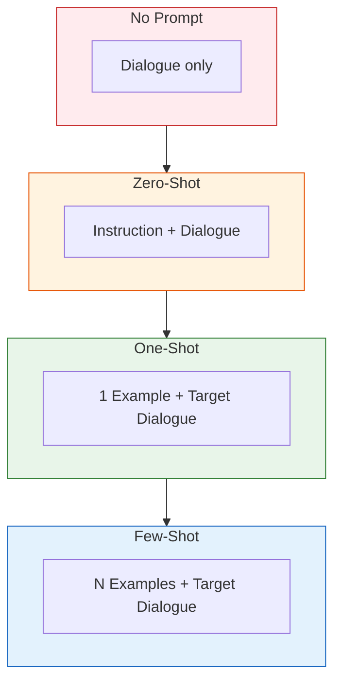
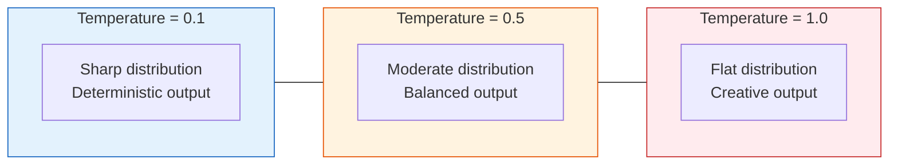

# Dialogue Summarizer

A modular dialogue summarization system built on the **FLAN-T5** transformer model.  
This project demonstrates how prompt engineering techniques -- zero-shot, one-shot,
and few-shot inference -- affect the quality of automatically generated summaries,
and how generation configuration parameters such as temperature control the
creativity-accuracy tradeoff.

---

## Table of Contents

- [Overview](#overview)
- [Background -- How Transformers Work](#background----how-transformers-work)
  - [From RNNs to Transformers](#from-rnns-to-transformers)
  - [The Attention Mechanism](#the-attention-mechanism)
  - [Encoder-Decoder Architecture](#encoder-decoder-architecture)
  - [Tokenization](#tokenization)
- [The FLAN-T5 Model](#the-flan-t5-model)
- [The DialogSum Dataset](#the-dialogsum-dataset)
- [Prompt Engineering Strategies](#prompt-engineering-strategies)
  - [No Prompt (Baseline)](#no-prompt-baseline)
  - [Zero-Shot Inference](#zero-shot-inference)
  - [One-Shot Inference](#one-shot-inference)
  - [Few-Shot Inference](#few-shot-inference)
- [Generation Configuration](#generation-configuration)
- [Project Structure](#project-structure)
- [Installation](#installation)
- [Usage](#usage)
- [References](#references)
- [License](#license)

---

## Overview

Large Language Models (LLMs) can perform a wide range of natural language tasks,
but their output quality depends heavily on *how* the task is presented to them.
This project focuses on a single, practical task -- **summarizing human
conversations** -- and systematically compares different prompting strategies to
measure their effect on summary quality.



The pipeline accepts a raw dialogue, wraps it in a prompt template, tokenizes it
into sub-word IDs, feeds those IDs through the FLAN-T5 encoder-decoder, generates
output token IDs autoregressively, and finally decodes them back into readable text.

---

## Background -- How Transformers Work

### From RNNs to Transformers

Before transformers, sequence models relied on Recurrent Neural Networks (RNNs)
and their variants (LSTMs, GRUs). These models process tokens one at a time in
sequential order, which creates two fundamental problems:

| Problem | Description |
|---------|-------------|
| **Vanishing gradients** | Gradients shrink as they propagate through long sequences, making it difficult for the model to learn dependencies between distant tokens. |
| **Sequential bottleneck** | Because each step depends on the previous one, training cannot be parallelized across sequence positions. |

The **Transformer** architecture, introduced in the paper *"Attention Is All You
Need"* (Vaswani et al., 2017), solves both problems by replacing recurrence
entirely with a mechanism called **self-attention**.



In an RNN, information flows left to right through a chain of hidden states. In a
transformer, every token attends to every other token simultaneously, enabling full
parallelism and direct long-range connections.

### The Attention Mechanism

Self-attention computes, for each token, a weighted combination of all other tokens
in the sequence. The weights are derived from learned **Query**, **Key**, and
**Value** projections:

$$
\text{Attention}(Q, K, V) = \text{softmax}\!\left(\frac{QK^{T}}{\sqrt{d_k}}\right) V
$$

Where:

| Symbol | Meaning |
|--------|---------|
| Q | Query matrix -- "what am I looking for?" |
| K | Key matrix -- "what do I contain?" |
| V | Value matrix -- "what information do I carry?" |
| d_k | Dimension of the key vectors (scaling factor) |

The softmax operation converts raw dot-product scores into a probability
distribution, so each output token is a weighted blend of the value vectors. The
division by the square root of d_k prevents the dot products from growing too large
in high-dimensional spaces.

**Multi-Head Attention** runs this computation multiple times in parallel (with
different learned projections), allowing the model to attend to different aspects of
the input simultaneously -- for example, one head might focus on syntactic
relationships while another captures semantic similarity.



### Encoder-Decoder Architecture

FLAN-T5 uses an **encoder-decoder** architecture, one of three common transformer
configurations:



The following diagram from the original *"Attention Is All You Need"* paper
illustrates the full architecture in detail. The left stack is the encoder (repeated
N times), and the right stack is the decoder (also repeated N times). Note how each
block contains multi-head attention, layer normalization (Add & Norm), and a
feed-forward network:

<p align="center">
  
</p>

<p align="center">
  <em>Figure: The Transformer model architecture (Vaswani et al., 2017).</em>
</p>

| Architecture | Models | Use Case |
|-------------|--------|----------|
| **Encoder-only** | BERT, RoBERTa | Classification, NER, extractive QA |
| **Decoder-only** | GPT, LLaMA | Text generation, chat, code completion |
| **Encoder-decoder** | T5, FLAN-T5, BART | Summarization, translation, generative QA |

The **encoder** processes the full input sequence bidirectionally (every token can
attend to every other token) and produces a rich contextual representation. The
**decoder** generates output tokens one at a time, attending both to previously
generated tokens (masked self-attention) and to the encoder's output
(cross-attention).

Each encoder and decoder block also contains:

- **Layer normalization** -- stabilizes training by normalizing activations.
- **Residual connections** -- add the block's input to its output, preventing
  degradation in deep networks.
- **Position-wise feed-forward networks** -- two linear transformations with a
  nonlinearity (typically ReLU or GELU) that add representational capacity.

### Tokenization

Raw text cannot be fed directly into a neural network. **Tokenization** converts
text into a sequence of integer IDs from a fixed vocabulary.



FLAN-T5 uses **SentencePiece** tokenization, a sub-word algorithm that:

1. Starts with individual characters as the base vocabulary.
2. Iteratively merges the most frequent adjacent pairs.
3. Produces a vocabulary of 32,100 sub-word tokens.

This approach handles rare and unseen words gracefully -- any word can be
decomposed into known sub-word pieces -- while keeping the vocabulary compact
enough for efficient computation.

| Step | Representation |
|------|----------------|
| Raw text | `"What time is it, Tom?"` |
| Sub-word tokens | `["What", "time", "is", "it", ",", "Tom", "?"]` |
| Token IDs | `[363, 97, 19, 34, 6, 3059, 58]` |
| Embedding vectors | 512-dimensional dense vectors per token |

The tokenizer is fully reversible: decoding maps token IDs back to readable text.

---

## The FLAN-T5 Model

**FLAN-T5** (Fine-tuned LAnguage Net) is a variant of Google's T5 model that has
been instruction-tuned on over 1,800 tasks phrased as natural language instructions.
This instruction tuning enables strong zero-shot and few-shot performance across
diverse tasks without task-specific fine-tuning.

| Property | Value |
|----------|-------|
| Base model | T5 (Text-to-Text Transfer Transformer) |
| Variant used | `google/flan-t5-base` |
| Parameters | 248 million |
| Vocabulary size | 32,100 tokens (SentencePiece) |
| Max input length | 512 tokens |
| Pre-training objective | Span corruption (denoising) |
| Fine-tuning | Instruction-tuned on 1,800+ tasks |

The model treats every NLP task as a text-to-text problem: the input is a text
string (possibly with an instruction prefix), and the output is also a text string.
This unified interface is what makes prompt engineering so effective -- different
prompts can steer the same model toward completely different behaviors.

---

## The DialogSum Dataset

The **DialogSum** dataset contains real-world dialogues with human-annotated
summaries, curated for research on abstractive dialogue summarization.

| Property | Value |
|----------|-------|
| Source | `knkarthick/dialogsum` (HuggingFace) |
| Total dialogues | 13,460 |
| Training set | 12,460 |
| Validation set | 500 |
| Test set | 500 |
| Avg. dialogue length | ~8 turns |
| Fields per entry | `dialogue`, `summary`, `topic` |

Each entry contains a multi-turn conversation (e.g., scheduling an appointment,
discussing plans, negotiating a purchase) paired with a concise human-written
summary.

---

## Prompt Engineering Strategies

Prompt engineering is the practice of designing input text to guide a pre-trained
model toward producing the desired output. The following diagram illustrates the
progression from no prompt to few-shot inference:



### No Prompt (Baseline)

The raw dialogue is passed directly to the model with no instruction. The model
has no explicit signal about what task to perform, so it typically continues the
conversation rather than summarizing it.

```
Input:  "#Person1#: Have you ever been to Paris? ..."
Output: "#Person1#: Yes, I have."    <-- continuation, not a summary
```

### Zero-Shot Inference

An instruction is prepended to the dialogue, explicitly asking the model to
summarize. No examples are provided.

Two templates are supported:

**Instruction template:**
```
Summarize the following conversation.

{dialogue}

Summary:
```

**FLAN-T5 template** (matches pre-training distribution):
```
Dialogue:

{dialogue}

What was going on?
```

The FLAN template tends to produce slightly better results because it matches one of
the prompt formats the model was exposed to during instruction tuning.

### One-Shot Inference

A single complete example (dialogue + reference summary) is placed before the target
dialogue. This gives the model a concrete demonstration of the expected input-output
format:

```
Dialogue:
{example_dialogue}

What was going on?
{example_summary}


Dialogue:
{target_dialogue}

What was going on?
```

The model uses the example to calibrate its output style, length, and level of
detail.

### Few-Shot Inference

Multiple examples (typically 2-5) are provided before the target. More examples
give the model a richer understanding of the expected behavior, but there are
diminishing returns beyond approximately 5 examples, and the total prompt must stay
within the model's 512-token context window.

```
[Example 1: dialogue + summary]
[Example 2: dialogue + summary]
[Example 3: dialogue + summary]

Dialogue:
{target_dialogue}

What was going on?
```

---

## Generation Configuration

The `GenerationConfig` class controls how the model selects output tokens during
inference. Key parameters:

| Parameter | Default | Description |
|-----------|---------|-------------|
| `max_new_tokens` | 50 | Maximum number of tokens to generate. |
| `do_sample` | `False` | If `False`, use greedy decoding (always pick the most probable token). If `True`, sample from the probability distribution. |
| `temperature` | 1.0 | Scales the logits before softmax. Lower values make the distribution sharper (more deterministic); higher values make it flatter (more random). |
| `top_k` | 50 | Restrict sampling to the top-k most probable tokens. |
| `top_p` | 1.0 | Nucleus sampling -- restrict sampling to the smallest set of tokens whose cumulative probability exceeds p. |



- **Low temperature (0.1)**: The model is highly confident and produces
  near-deterministic output. Good for factual summarization.
- **Medium temperature (0.5)**: Moderate randomness. Balances faithfulness with
  variety.
- **High temperature (1.0)**: High randomness. Output is more creative but may
  hallucinate or drift from the source dialogue.

---

## Project Structure

```
inference-strategies-llm/
    assets/
        transformer-architecture.png   Original diagram from "Attention Is All You Need".
    summarizer.py                      Core module: DialogueSummarizer class with all
                                       inference strategies and prompt construction.
    main.py                            Entry point: runs a full demonstration of every
                                       strategy with formatted terminal output.
    requirements.txt                   Pinned Python dependencies.
    README.md                          This file.
```

---

## Installation

**Prerequisites**: Python 3.9 or higher.

```bash
# 1. Clone the repository
git clone https://github.com/<your-username>/generative-ai-with-llms.git
cd generative-ai-with-llms/inference-strategies-llm

# 2. Create a virtual environment (recommended)
python -m venv venv
source venv/bin/activate        # Linux / macOS
venv\Scripts\activate           # Windows

# 3. Install dependencies
pip install -r requirements.txt
```

The first run will automatically download the FLAN-T5 model weights (~990 MB) and
the DialogSum dataset from HuggingFace Hub. Subsequent runs use the cached versions.

---

## Usage

```bash
python main.py
```

The script runs through all inference strategies in sequence and prints a formatted
comparison between the human reference summary and the model's generated summary for
each strategy.

You can also import the `DialogueSummarizer` class directly in your own scripts:

```python
from summarizer import DialogueSummarizer

s = DialogueSummarizer()

# Zero-shot
summary = s.zero_shot(s.get_dialogue(42), template="flan")

# Few-shot with custom temperature
summary = s.few_shot(
    example_indices=[10, 20, 30],
    target_index=42,
    do_sample=True,
    temperature=0.3,
)
```

---

## References

- Vaswani, A. et al. (2017). *Attention Is All You Need*. NeurIPS.
  https://arxiv.org/abs/1706.03762
- Raffel, C. et al. (2020). *Exploring the Limits of Transfer Learning with a
  Unified Text-to-Text Transformer*. JMLR.
  https://arxiv.org/abs/1910.10683
- Chung, H. W. et al. (2022). *Scaling Instruction-Finetuned Language Models*.
  https://arxiv.org/abs/2210.11416
- Chen, Y. et al. (2021). *DialogSum: A Real-Life Scenario Dialogue Summarization
  Dataset*. ACL Findings.
  https://arxiv.org/abs/2105.06762
- Kudo, T. & Richardson, J. (2018). *SentencePiece: A simple and language
  independent subword tokenizer and detokenizer for Neural Text Processing*.
  https://arxiv.org/abs/1808.06226

---

## License

This project is released under the [MIT License](https://opensource.org/licenses/MIT).
